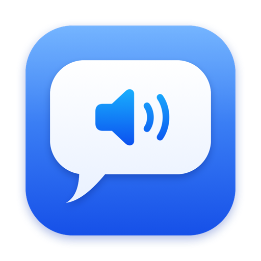

<h1 align="center">SwipeSpeak</h1>

<b>Talk and it types. Select and it reads.</b> One Mac menu bar app for both.

<a href="https://lman80.github.io/SwipeSpeak-app/"><b>Website</b></a> · <a href="https://github.com/lman80/SwipeSpeak-app/releases/latest"><b>Download the latest version</b></a>

- **Dictation:** hold your talk key, speak, let go. Your words are typed wherever your cursor is.
- **Read Aloud:** select text in any app and glide onto the 🔊 bubble to hear it in your Mac's Siri voice. Rest on ✨ for a short AI summary.

**Requirements:** macOS 14 Sonoma or later on a Mac with Apple silicon.

### Install
1. Download `SwipeSpeak.zip` from the [latest release](https://github.com/lman80/SwipeSpeak-app/releases/latest), unzip it and move `SwipeSpeak.app` to Applications.
2. Open it once. macOS will say it can't check the app. Go to **System Settings › Privacy & Security**, scroll down and click **Open Anyway**.
3. The Setup Guide walks you through the rest.

SwipeSpeak updates itself from this page's releases.

---
This repository holds only the website and release downloads for SwipeSpeak.
